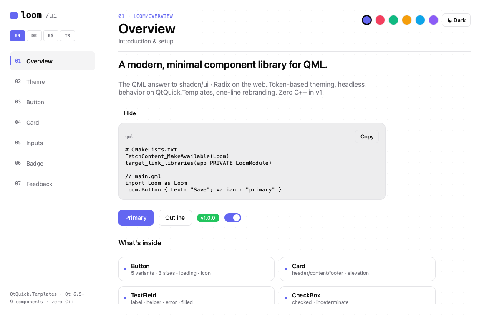
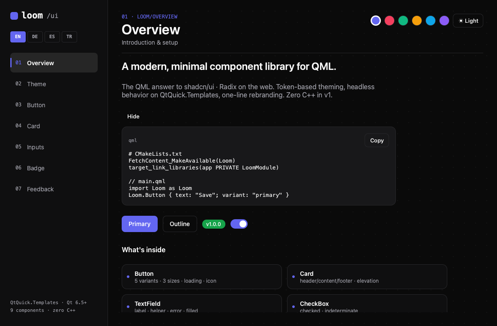
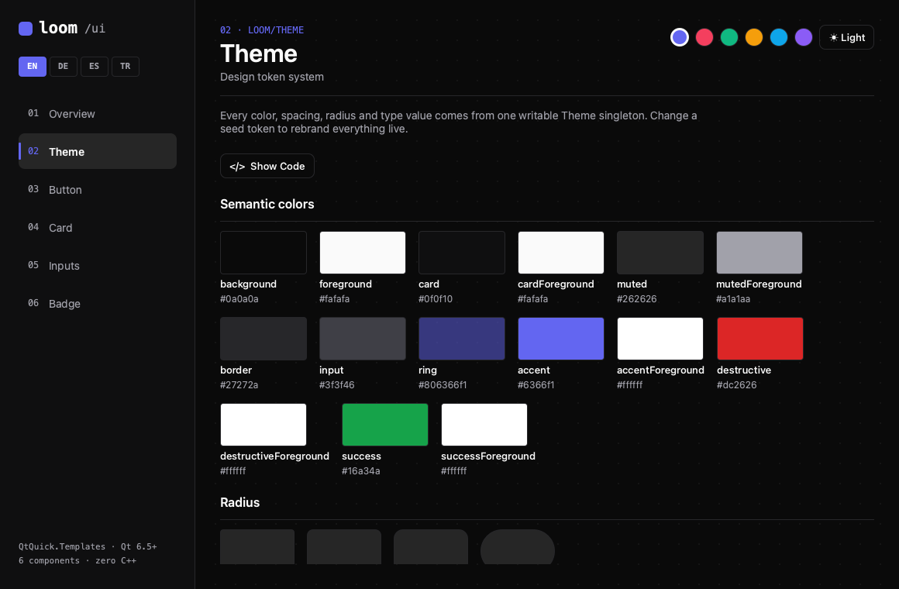
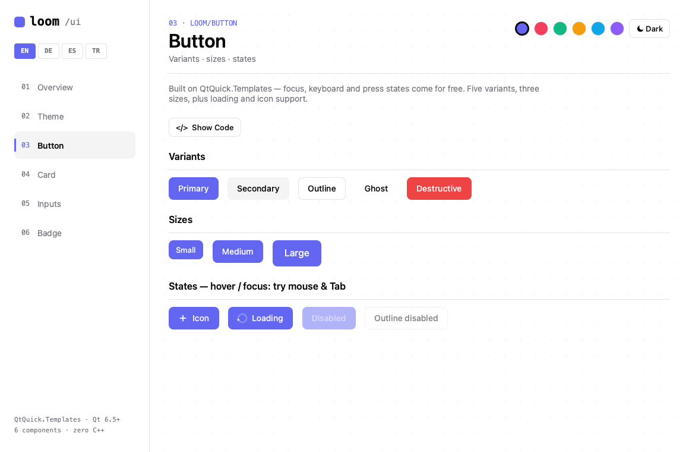
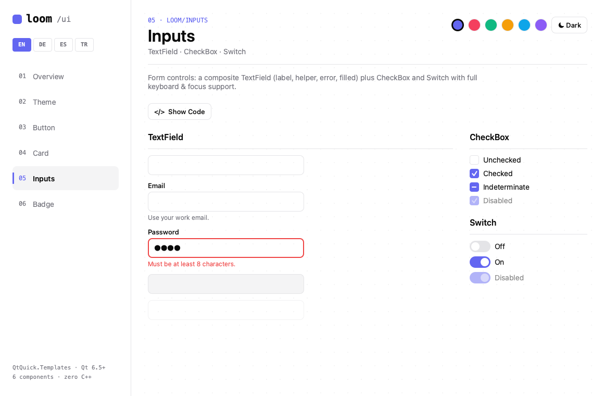
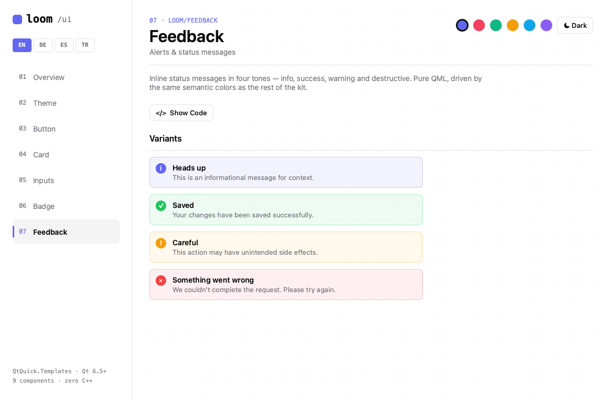

# Loom

> A small, themeable QML component library for Qt 6 — built entirely in pure QML, zero C++.

[](LICENSE)
[](https://www.qt.io/)
[]()

<p align="center">
  
</p>

Loom is a set of clean, accessible UI controls for Qt Quick applications. It ships a
single design-token singleton (`Theme`) that drives every component, so you can
restyle the whole library — light/dark, accent color, corner radius, typography —
by overriding a handful of properties. No C++ is required to use or build it.

## Features

- **Pure QML** — no C++ types, no plugins to compile. Just a QML module.
- **Token-driven theming** — one `Theme` singleton controls colors, spacing, radius,
  typography and motion across every component.
- **Light & dark** out of the box, switchable at runtime.
- **Semantic colors** with sensible defaults that you can override individually.
- **Accessible focus** — a shared `FocusRing` primitive gives consistent keyboard
  focus across all controls.
- **Drop-in via FetchContent** — consume it from any Qt 6 CMake project.

## Components

| Control | Description |
|---|---|
| `Button` | Filled / outline / ghost variants with hover & press states |
| `Card` | Elevated surface container |
| `TextField` | Single-line text input with focus ring |
| `CheckBox` | Boolean control with animated check |
| `Switch` | Toggle control with animated thumb |
| `Slider` | Draggable value slider with steps & keyboard support |
| `RadioButton` | Single-choice control; group several with `RadioGroup` |
| `Badge` | Compact status / label pill |
| `Alert` | Inline status callout — info / success / warning / destructive |

Plus the building blocks: `Theme` (token singleton), `FocusRing` and `Elevation`.

## Requirements

- Qt **6.5** or newer (Quick)
- CMake **3.21+**
- A C++17 toolchain (only to build Qt's QML module — the library itself is pure QML)

## Install (CMake FetchContent)

```cmake
include(FetchContent)
FetchContent_Declare(
    loom
    GIT_REPOSITORY https://github.com/alhn7/loom-qml.git
    GIT_TAG        v1.0
)
FetchContent_MakeAvailable(loom)

target_link_libraries(myapp PRIVATE LoomModule)
```

## Usage

```qml
import QtQuick
import QtQuick.Controls
import Loom

ApplicationWindow {
    width: 360; height: 240
    visible: true
    color: Theme.background

    Component.onCompleted: {
        Theme.accent = "#10b981"      // recolor the whole library
        Theme.radius = 12
        Theme.appearance = Theme.Dark // flip to dark mode
    }

    Column {
        anchors.centerIn: parent
        spacing: Theme.spacing.md

        Button { text: "Primary" }
        Switch { checked: true }
        Badge  { text: "New" }
    }
}
```

## Theming

Every visual decision flows from the `Theme` singleton. Override the **seed tokens**
and the rest of the palette re-derives automatically:

| Token | Default | Effect |
|---|---|---|
| `Theme.appearance` | `Theme.Light` | Light / dark mode |
| `Theme.accent` | `#6366f1` | Primary brand color |
| `Theme.radius` | `8` | Base corner radius (scales to `radiusSm/Md/Lg`) |
| `Theme.fontFamily` | system | Typeface for the whole library |

Semantic colors (`background`, `foreground`, `card`, `muted`, `border`, …) bind to
`appearance` by default but can be set explicitly for full control.

## Gallery

The repository ships an interactive gallery that showcases every component and lets
you tweak theme tokens live — flip light/dark, change the accent color, and watch
every control update instantly.

```bash
cmake --preset default
cmake --build build
./build/examples/gallery/galleryapp
```

| Dark mode | Design tokens |
|---|---|
|  |  |

| Buttons — variants, sizes & states | Inputs — TextField, CheckBox, Switch, Slider, Radio |
|---|---|
|  |  |

| Feedback — Alert in four tones |
|---|
|  |

## License

[MIT](LICENSE) © 2025 Alihan
